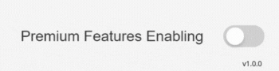

<strong>How to use</strong><br>
```html
<div class="form-group">
  <app-toggle>
    label="Premium Features Enabling"
    [checked]="isPremium"
    (checkedChanged)="isPremium = $event"
    [disabled]="false">
  </>
</div>
```
It is recommended to be used enveloped by a form group container.
